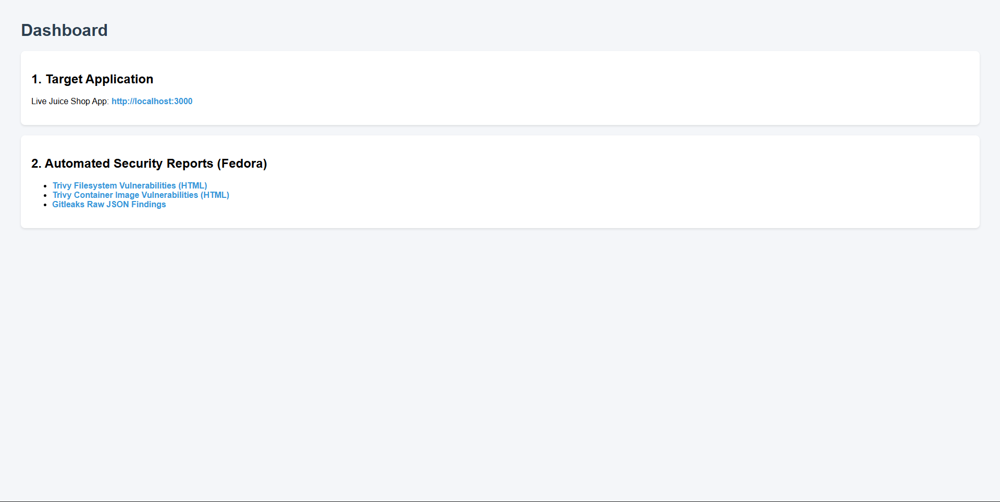
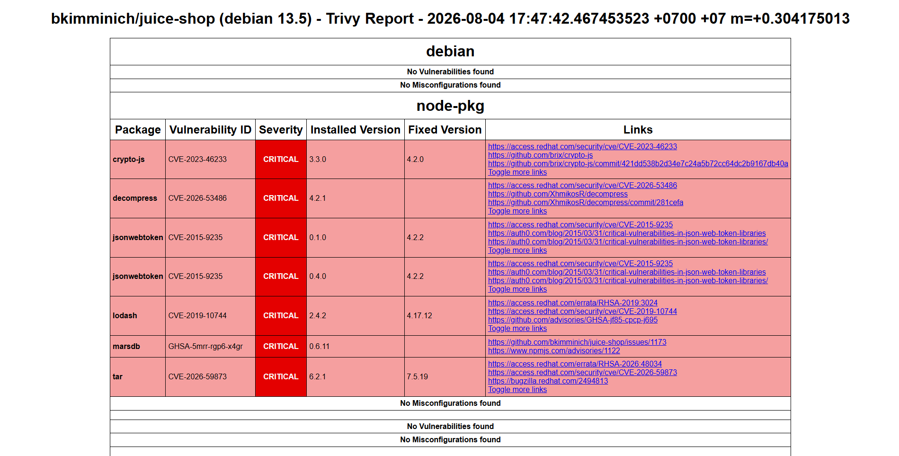
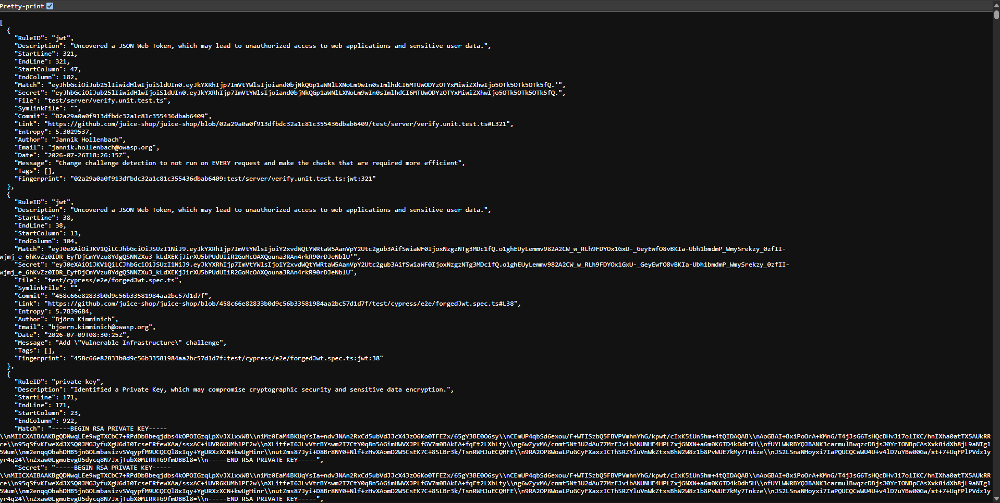
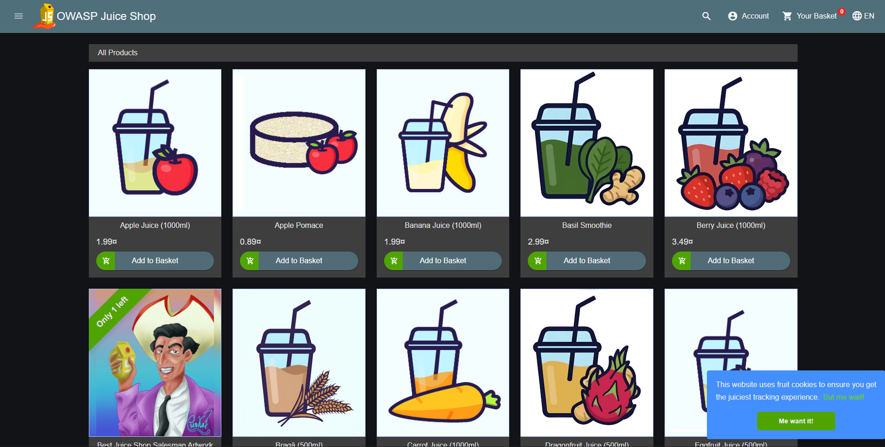

# Automated CI/CD Security Pipeline

A local, reproducible pipeline demonstrating Shift-Left Security principles. Automates secret detection, filesystem and container vulnerability scanning, security report generation, and deployment. Built for local execution and easily portable to CI/CD runners such as GitHub Actions or GitLab CI.

---

## System Screenshots

### Security Dashboard

*Unified Nginx Security Dashboard (Port 8000)*

### Security Reports
| Trivy Vulnerability Scan | Gitleaks Secret Scan |
| :---: | :---: |
|  |  |
| *Trivy CVE Analysis Report* | *Gitleaks Detected Secrets Report* |

### Deployed Application

*Target Application (OWASP Juice Shop - Port 3000)*

---

## Pipeline Workflow

```text
┌─────────────────┐    ┌─────────────────┐    ┌──────────────────┐    ┌─────────────────┐
│ Execution /     │───>│ Gitleaks Scan   │───>│ Trivy Image Scan │───>│ Deployment &    │
│ CI Pipeline     │    │ (Secret Check)  │    │ (CVE Check)      │    │ Nginx Dashboard │
└─────────────────┘    └─────────────────┘    └──────────────────┘    └─────────────────┘
```

1. **Secret Detection (Gitleaks):** Scans the codebase for hardcoded secrets and credentials.
2. **Container Security (Trivy):** Analyzes target container images and Dockerfiles for High/Critical CVEs and formats results into HTML reports.
3. **Deployment & Dashboard:** Deploys target application containers via Docker and serves aggregated reports via a dedicated Nginx dashboard.

---

## Tech Stack

* **Security Tools:** Trivy, Gitleaks
* **Containerization & Hosting:** Docker, Nginx
* **Automation:** Bash Shell Scripting
* **Target Application:** OWASP Juice Shop (Node.js)

---

## Repository Structure

```text
.
├── deploy-and-scan.sh     # Main CI/CD pipeline orchestration script
├── .env.example           # Template for environment configuration
├── mock-vulnerable-app/   # Sample application for testing
│   ├── Dockerfile
│   └── app.js
└── reports/               # Auto-generated security report artifacts
```

---

## Getting Started

### Prerequisites
* Docker & Docker Engine
* Git
* Trivy & Gitleaks installed locally

### Quick Start

1. **Clone the repository:**
   ```bash
   git clone https://github.com/MadManJJ/appsec-scan-dashboard.git
   cd appsec-scan-dashboard
   ```

2. **Configure environment:**
   ```bash
   cp .env.example .env
   ```

3. **Execute the pipeline:**
   ```bash
   chmod +x deploy-and-scan.sh
   ./deploy-and-scan.sh
   ```

4. **Access Dashboard & App:**
   * **Security Dashboard:** `http://localhost:8000`
   * **Target Application:** `http://localhost:3000`

> **CI/CD Integration:** To run this in GitHub Actions, GitLab CI, or Jenkins, execute `deploy-and-scan.sh` directly as a pipeline step or adapt the script commands into your workflow configuration.

---

## Homelab Architecture

Developed in a local Fedora homelab environment accessed remotely from Windows via SSH local port forwarding.

```text
┌─────────────────────────┐          Ethernet / SSH          ┌──────────────────────────────────┐
│   Windows Host (Client) │ ───────────────────────────────> │  Fedora Workstation (Homelab)    │
│  Browser: localhost:8000│   -L 8000:localhost:8000         │  - Docker Container (Nginx)      │
│  Browser: localhost:3000│   -L 3000:localhost:3000         │  - Docker Container (Juice Shop) │
└─────────────────────────┘                                  └──────────────────────────────────┘
```
